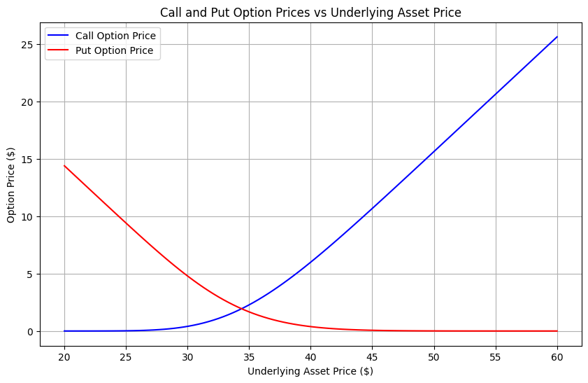

# Black-Scholes Option Pricing Model

This repository contains an implementation of the Black-Scholes option pricing model for European call and put options. The script calculates the theoretical price of options based on the Black-Scholes formula, which takes into account factors like the underlying asset price, strike price, time to expiration, risk-free rate, and volatility.

## Overview

The script provides a visual representation of how the prices of European call and put options change as a function of the underlying asset price. The Black-Scholes model is used to compute the option prices, and the results are displayed using `matplotlib`.

### Key Features:
- **Call Option Price Calculation**: Computes the theoretical price of a European call option.
- **Put Option Price Calculation**: Computes the theoretical price of a European put option.
- **Graphical Representation**: Generates a plot of option prices against varying underlying asset prices.

## Installation

To run the script locally, you need to have Python installed on your machine. You'll also need to install the required libraries.

1. **Clone the repository**:

   ```bash
   git clone https://github.com/SHIVANIUM-GIT/Black_Scholes_Option_Pricing_Model.git
   cd black-scholes-option-pricing
   ```

2. **Install dependencies**:

   You can install the required libraries using `pip`:

   ```bash
   pip install -r requirements.txt
   ```

   Alternatively, install the necessary libraries manually:

   ```bash
   pip install numpy scipy matplotlib
   ```

## Usage

1. **Run the script**:

   To execute the script, simply run the Python file:

   ```bash
   python black_scholes.py
   ```

   This will generate a graph showing how the prices of European call and put options change as the underlying asset price varies. The plot will be displayed using `matplotlib`.

2. **Adjust Parameters**:

   You can modify the parameters in the script, such as the strike price (`K`), time to expiration (`T`), risk-free rate (`r`), and volatility (`vol`) to see how they affect the option prices.

   Here is a list of adjustable parameters in the code:

   - `K`: Strike Price (e.g., 42)
   - `T`: Time to Expiration in years (e.g., 2)
   - `r`: Risk-Free Rate (e.g., 0.1)
   - `vol`: Volatility (e.g., 0.1)

3. **Output**:

   The script generates a plot where:
   - The **blue line** represents the price of the **Call Option**.
   - The **red line** represents the price of the **Put Option**.

   The plot will display how the prices of these options change with respect to the underlying asset price, ranging from $20 to $60 in the example.

## Dependencies

- **Python**: Version 3.x or higher
- **Libraries**:
  - `numpy` for numerical operations
  - `scipy` for statistical functions (used for the cumulative distribution function)
  - `matplotlib` for generating plots

You can install all dependencies using the following:

```bash
pip install numpy scipy matplotlib
```

## Contributing

If you'd like to contribute to this project, feel free to fork the repository, make changes, and submit a pull request. Please make sure to include tests for new features or bug fixes.

### Steps to Contribute:

1. Fork the repository.
2. Create a new branch (`git checkout -b feature-name`).
3. Make your changes and commit (`git commit -am 'Add feature'`).
4. Push to the branch (`git push origin feature-name`).
5. Create a new pull request.


### OUTPUT

